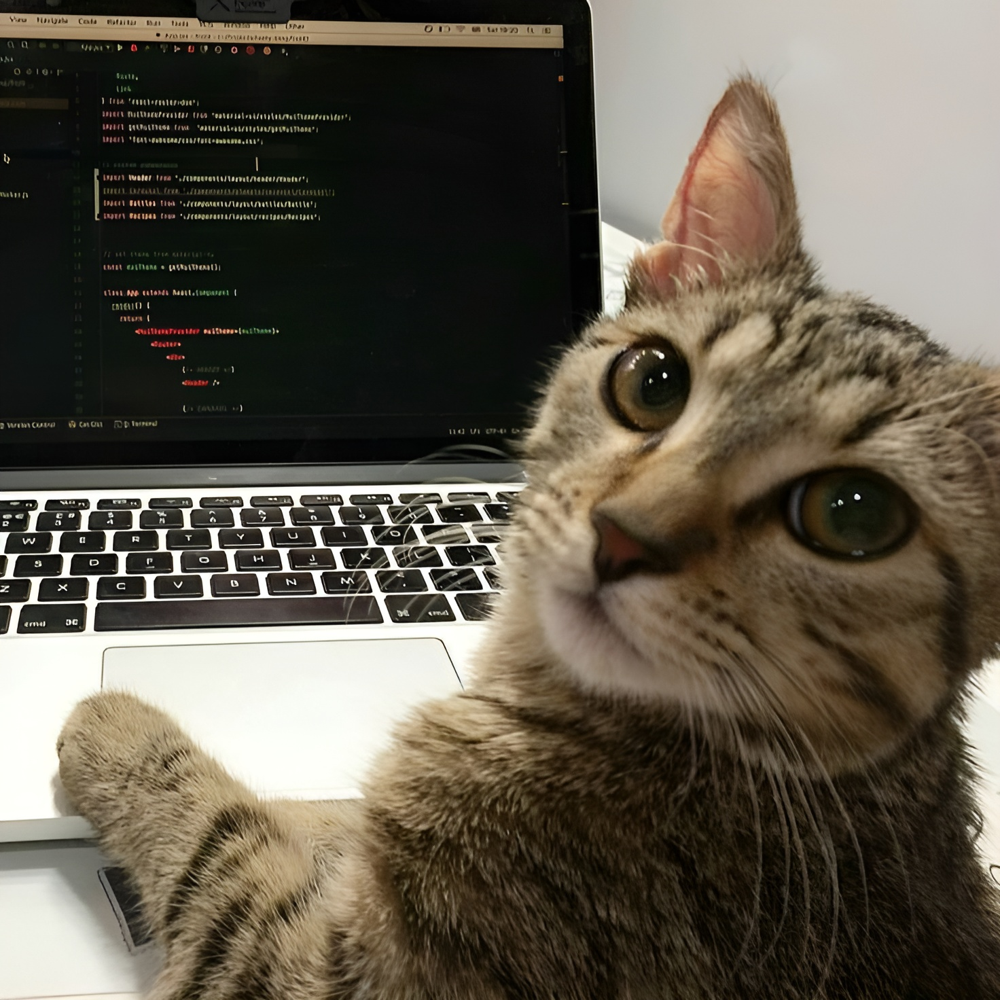

<blockquote>
    <p><i>
        "When do you think people die? When they're shot through the heart with a pistol? No. When they have an uncurable disease? No. When they drink soup made from a poisonous mushroom? No! When they are forgotten!" - Eiichiro Oda ☠️
    </i></p>
</blockquote>
</div>



[](https://git.io/typing-svg)

<p align="left">🌙 Graduated in systems analysis and development, Data Analyst & Back-End enthusiast</p>

<h3 align="left">Connect with me!</h3>

[](mailto:carolmagalhaes.lima@gmail.com)
[](https://www.linkedin.com/in/carolmagalhaeslima/)
[](https://dev.to/tsuukisz)

<h3 align="left">My Stack</h3>

<div align="left">
  
  
  
  
  
  
  
  
  
  
  
  
</div>

<h3>GitHub Stats</h3>

<a href="https://github.com/tsuukisz">
    
    
</a>
<br>

<picture>
  <source media="(prefers-color-scheme: dark)" srcset="https://raw.githubusercontent.com/tsuukisz/tsuukisz/output/github-contribution-grid-snake-dark.svg">
  <source media="(prefers-color-scheme: light)" srcset="https://raw.githubusercontent.com/tsuukisz/tsuukisz/output/github-contribution-grid-snake.svg">
  
</picture>
<!--  -->

<!--START_SECTION:waka-->

```txt
Markdown         0 secs          ██████████████▓░░░░░░░░░░   58.31 %
GitIgnore file   0 secs          ███████▓░░░░░░░░░░░░░░░░░   30.10 %
Java             0 secs          ███░░░░░░░░░░░░░░░░░░░░░░   11.59 %
```

<!--END_SECTION:waka-->
